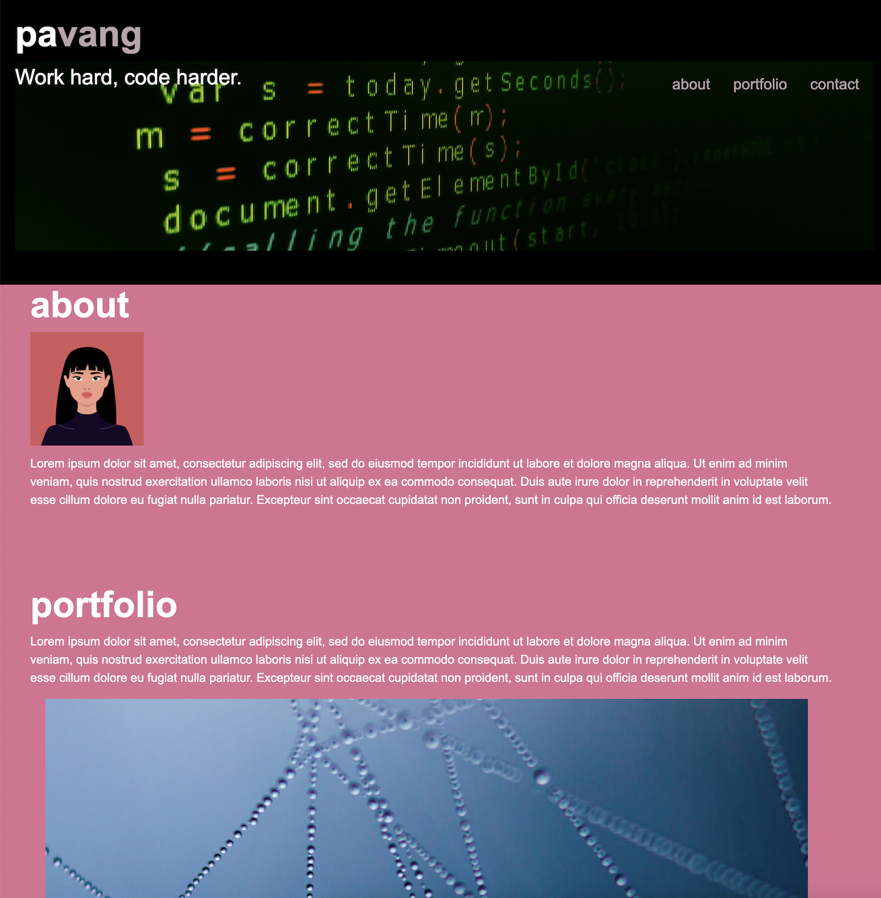

# CSS-Project

# Hey! It's my portfolio!
This website will eventually provide actual information about my work and provide information about me and my journey in the coding world! Current sections include an about me, list of projects and ways to communicate with me.

## About
You can learn a little bit about me here (well...in the future when I add actual content). Right now there's an avatar image slotted as a placeholder.

## Portfolio
This section shows off some of the projects that I have worked. Each project has a picture and a link to its GitHub page.

## Contact
This section lists all the ways you can contact me.

## How to Use
If you want to see this website on your own computer, follow these simple steps:
1. Clone the repository: Click on the "Code" button above and select "Download ZIP". Extract the ZIP file to your computer.
2. Open the project folder and find the file named: index.html.
3. Double-click on: index.html to open it in your web browser.

